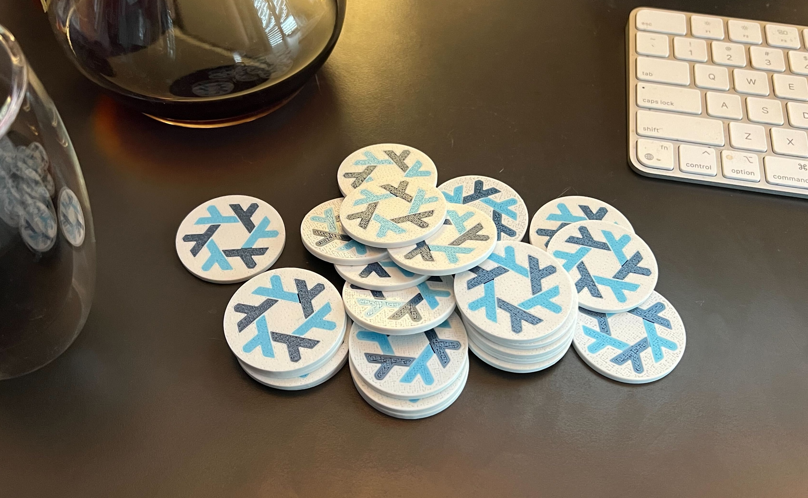

# Nix Discs

These are source files for 3D printed discs with the Nix project logo on them.

Some people might call these "pogs".

## Usage

1. Download [Bambu Studio](https://github.com/bambulab/BambuStudio) to open the `*.3mf` files in this repo
2. Purchase a Bambu printer and print out the discs [optional]

I find that using the Bambu bed adhesive can lead to consistent adhesion, and I can get quality prints in a variety of temperature and humidity conditions using the enclosed chamber of my X1C.

## Examples

